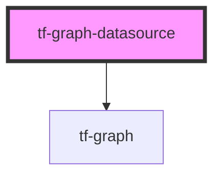

# tf-graph-datasource

<!-- Auto Generated Below -->

## Properties

| Property                     | Attribute                         | Description                                                                                                         | Type                      | Default                                                                                                                                                                                             |
| ---------------------------- | --------------------------------- | ------------------------------------------------------------------------------------------------------------------- | ------------------------- | --------------------------------------------------------------------------------------------------------------------------------------------------------------------------------------------------- |
| `additionalContextOptions`   | --                                |                                                                                                                     | `ContextMenuOptions`      | `null`                                                                                                                                                                                              |
| `axisDragDataZoomShouldShow` | `axis-drag-data-zoom-should-show` | to get the visibility for axis drag zoom                                                                            | `boolean`                 | `false`                                                                                                                                                                                             |
| `chartType`                  | `chart-type`                      | gets the chartType data                                                                                             | `string`                  | `''`                                                                                                                                                                                                |
| `dataZoomHeight`             | `data-zoom-height`                |                                                                                                                     | `number \| string`        | `20`                                                                                                                                                                                                |
| `dataZoomOrient`             | `data-zoom-orient`                | to get the orientation for axis drag zoom                                                                           | `string`                  | `"horizontal"`                                                                                                                                                                                      |
| `graphHeight`                | `graph-height`                    | it's stores the information for the height of the graph                                                             | `number`                  | `0`                                                                                                                                                                                                 |
| `graphTitle`                 | `graph-title`                     | graphTitle used to set the graph title text                                                                         | `string`                  | `undefined`                                                                                                                                                                                         |
| `graphWidth`                 | `graph-width`                     | it's stores the information for the width of the graph                                                              | `number`                  | `0`                                                                                                                                                                                                 |
| `grid`                       | --                                | to set the padding for the graph control w.r.t to the parent container                                              | `GraphGrid[]`             | `undefined`                                                                                                                                                                                         |
| `legend`                     | --                                | Gets legend data                                                                                                    | `LegendData[]`            | `undefined`                                                                                                                                                                                         |
| `toolbox`                    | --                                | toolbox is used to pass all the properties related drag to zoom feature                                             | `ToolboxComponentOption`  | `{         feature: {             dataZoom: {                 icon: {                     zoom: 'path://',                     back: 'path://',                 },             },         },     }` |
| `tooltipDataPoints`          | --                                | tooltipDataPoints used to set the customized tooltip message w.r.t to coordinates value                             | `TooltipData[]`           | `[]`                                                                                                                                                                                                |
| `traceData`                  | --                                | traceData used to set the all the properties for each traces which includes trace type, line type, marker type etc. | `TraceDataTypes[]`        | `[]`                                                                                                                                                                                                |
| `visualMapData`              | --                                | to get the visualmap data when chart type is heatmap                                                                | `VisualMapData`           | `undefined`                                                                                                                                                                                         |
| `xAxisBase`                  | `x-axis-base`                     | it's stores the base value of x-axis data when axis type is logarithmic                                             | `number`                  | `10`                                                                                                                                                                                                |
| `xAxisData`                  | --                                | to get the x-axis data                                                                                              | `(string \| number)[]`    | `null`                                                                                                                                                                                              |
| `xAxisTick`                  | --                                | to get the x-axis tick                                                                                              | `AxisTick`                | `{         alignWithLabel: true     }`                                                                                                                                                              |
| `xAxisTitle`                 | `x-axis-title`                    | xAxisTitle used to set the x-axis title text                                                                        | `string`                  | `undefined`                                                                                                                                                                                         |
| `xAxisType`                  | `x-axis-type`                     | xAxisType used to set the x-axis type whether it will be 0(linear) or 1(logarithmic)                                | `number`                  | `0`                                                                                                                                                                                                 |
| `xMax`                       | `x-max`                           | xMax is used to set the x-axis maximum range                                                                        | `number`                  | `undefined`                                                                                                                                                                                         |
| `xMin`                       | `x-min`                           | xMin is used to set the x-axis minimum range                                                                        | `number`                  | `undefined`                                                                                                                                                                                         |
| `yAxis`                      | --                                | to get all the data regarding y-axis                                                                                | `AxisDataResponseTypes[]` | `undefined`                                                                                                                                                                                         |
| `yAxisBase`                  | `y-axis-base`                     | it's stores the base value of y-axis data when axis type is logarithmic                                             | `number`                  | `10`                                                                                                                                                                                                |

## Dependencies

### Depends on

- [tf-graph](../tf-graph)

### Graph

----------------------------------------------

*Built with [StencilJS](https://stenciljs.com/)*
