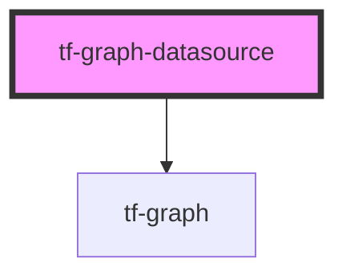

# tf-graph-datasource

<!-- Auto Generated Below -->

## Properties

| Property      | Attribute      | Description | Type     | Default     |
| ------------- | -------------- | ----------- | -------- | ----------- |
| `graphTitle`  | `graph-title`  |             | `any`    | `undefined` |
| `lineType`    | `line-type`    |             | `any`    | `undefined` |
| `marekerType` | `mareker-type` |             | `any`    | `undefined` |
| `traceType`   | `trace-type`   |             | `string` | `'line'`    |
| `xAxisType`   | `x-axis-type`  |             | `any`    | `undefined` |
| `yAxisType`   | `y-axis-type`  |             | `any`    | `undefined` |
| `zoomType`    | `zoom-type`    |             | `any`    | `undefined` |

## Dependencies

### Depends on

- [tf-graph](../tf-graph)

### Graph

----------------------------------------------

*Built with [StencilJS](https://stenciljs.com/)*
