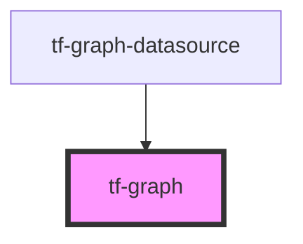

# tf-graph

<!-- Auto Generated Below -->

## Properties

| Property                   | Attribute       | Description                                                                                                                                                                                                                                                                                                                                                                                                                                                                                                                                                                                                                                                                                                                                                                                                                                                                             | Type                     | Default                                                  |
| -------------------------- | --------------- | --------------------------------------------------------------------------------------------------------------------------------------------------------------------------------------------------------------------------------------------------------------------------------------------------------------------------------------------------------------------------------------------------------------------------------------------------------------------------------------------------------------------------------------------------------------------------------------------------------------------------------------------------------------------------------------------------------------------------------------------------------------------------------------------------------------------------------------------------------------------------------------- | ------------------------ | -------------------------------------------------------- |
| `additionalContextOptions` | --              | additionalContextOptions is used to send the context-menu options from the consumer end                                                                                                                                                                                                                                                                                                                                                                                                                                                                                                                                                                                                                                                                                                                                                                                                 | `ContextMenuOptions`     | `undefined`                                              |
| `dataZoom`                 | --              | dataZoom stores the information about all the customized feature of zooming in graph control, the minimum required value are given below {      type: {'inside' \| 'slider'} type of zooming feature }                                                                                                                                                                                                                                                                                                                                                                                                                                                                                                                                                                                                                                                                                  | `DataZoomType[]`         | `undefined`                                              |
| `expandLegend`             | `expand-legend` | Gets the info to open or close the legend on load                                                                                                                                                                                                                                                                                                                                                                                                                                                                                                                                                                                                                                                                                                                                                                                                                                       | `boolean`                | `true`                                                   |
| `graphHeight`              | `graph-height`  | it's stores the information for the height of the graph                                                                                                                                                                                                                                                                                                                                                                                                                                                                                                                                                                                                                                                                                                                                                                                                                                 | `number`                 | `0`                                                      |
| `graphTitle`               | --              | graphTitle prop stores the information of graph main title, the minimum required value are given below {  text: { 'name' } text content for the title of the graph,  top: { 'top' \| 'bottom' \| 'middle' or 'center' \| 'left' \| 'right' }, position from the top side of the graph  left: { 'top' \| 'bottom' \| 'middle' or 'center' \| 'left' \| 'right' }, position from the left side of the graph  padding: { ['10','10','10','10'] }, any numeric value of paadding from the respective places in this format [top,right,bottom,left]  textStyle: {      fontSize: { '10' }, font size of the graph title in the numeric value format      color: { 'black' \| 'rgb(255,255,255)' \| '#fff' }, set the color of the graph title in different format  } }                                                                                                                       | `TitleOption`            | `undefined`                                              |
| `graphWidth`               | `graph-width`   | it's stores the information for the width of the graph                                                                                                                                                                                                                                                                                                                                                                                                                                                                                                                                                                                                                                                                                                                                                                                                                                  | `number`                 | `0`                                                      |
| `grid`                     | --              | it's stores the information for the padding from the parent container                                                                                                                                                                                                                                                                                                                                                                                                                                                                                                                                                                                                                                                                                                                                                                                                                   | `GraphGrid[]`            | `[{ right: '2%', bottom: '15%', top:'14%', left: '7%'}]` |
| `legend`                   | --              | Gets legend data                                                                                                                                                                                                                                                                                                                                                                                                                                                                                                                                                                                                                                                                                                                                                                                                                                                                        | `LegendData[]`           | `undefined`                                              |
| `renderer`                 | `renderer`      | renderer prop used to visualisation mode of graph (svg is the default value)                                                                                                                                                                                                                                                                                                                                                                                                                                                                                                                                                                                                                                                                                                                                                                                                            | `"canvas" \| "svg"`      | `'svg'`                                                  |
| `series`                   | --              | series stores the information all the traces and their properties {  name: {'NAME OF THE TRACES'}, name of the traces which will be showing into legend data  id: {'SERIES_1'}, id of the series  data: { '[[10, 20],[30, 40]]' \| '[[1.5, 2.5],[3.5, 4.5]]'}, data-points for the graph  type: {'line' \| 'bar' \| 'pie' \| 'scatter' \| 'bar' ...} type of traces  symbol: { 'circle' \| 'rect' \| 'roundRect' \| 'triangle' \| 'diamond' \| 'pin' \| 'arrow' \| 'none'}, types of coordinates symbol  symbolSize: { [3,3] }, size of the coordinates symbol numeric format ['width','height']  lineStyle:{  type: { 'solid' \| 'dashed' \| 'dotted' }, if the traces type is line then type line should mention here  color: { 'black' \| 'rgb(255,255,255)' \| '#fff' }, set the color of the line traces  width: { 10 \| 2 }, set the width of the line in numeric value      }  } | `SeriesOption$1[]`       | `undefined`                                              |
| `theme`                    | `theme`         | theme prop used to set the the background color of the graph whether it will be dark or white (white is default value)                                                                                                                                                                                                                                                                                                                                                                                                                                                                                                                                                                                                                                                                                                                                                                  | `Object \| string`       | `'white'`                                                |
| `toolbox`                  | --              | toolbox stores the information about position of rubberband zooming icon {    orient: { 'horizontal' \| 'vertical'}, sequence of the toolbox icon    top: { 'top' \| 'bottom' \| 'middle' or 'center' \| 'left' \| 'right' }, position from the top side of the graph    right: { 'top' \| 'bottom' \| 'middle' or 'center' \| 'left' \| 'right' \| 20 \| 20% }, position from the left side of the graph can be in pixel, percent also    feature:    {      dataZoom:{              icon: {                  zoom: { 'path://' }, to hide zoom icon                  back: { 'path://' }, to hide zoom reset icon                 }            }    }                                                                                                                                                                                                                                 | `ToolboxComponentOption` | `undefined`                                              |
| `tooltip`                  | --              | tooltip stores the information about all the customized feature of tooltip, the minimum required value are given below {      axisPointer: {          type: {'cross' \| 'line' \| 'shadow' \| 'none'} types of cross-hair feature    } }                                                                                                                                                                                                                                                                                                                                                                                                                                                                                                                                                                                                                                                | `TooltipDataTypes`       | `undefined`                                              |
| `visualMap`                | --              | visualMap is a type of properties for visual encoding, which maps the data to visual channels                                                                                                                                                                                                                                                                                                                                                                                                                                                                                                                                                                                                                                                                                                                                                                                           | `VisualMapData`          | `undefined`                                              |
| `xAxis`                    | --              | xAxis stores the information about all the customized feature of xAxis, the minimum required value are given below  type: {'value' \| 'category' \| 'time' \| 'log'}, type of axis  name: {'TITLE OF THE AXIS'}, title of the axis  nameLocation: { 'start' \| 'middle' or 'center' \| 'end' }, loaction of the title w.r.t to the axis  nameTextStyle:{      fontSize: {'Numeric Value'}, font size of the axis title      color: { 'black' \| 'rgb(255,255,255)' \| '#fff' }, set the color of the axis name in different format  },  max: { '0.5' \| '100' \| '16' }, any integer value can be the max value of the axis  min: { '0.1' \| '10' \| '8' } any integer value can be the min value of the axis                                                                                                                                                                           | `AxisDataProperties`     | `undefined`                                              |
| `yAxis`                    | --              | yAxis stores the information about all the customized feature of yAxis  type: {'value' \| 'category' \| 'time' \| 'log'}, type of axis  name: {'TITLE OF THE AXIS'}, title of the axis  nameLocation: { 'start' \| 'middle' or 'center' \| 'end' }, loaction of the title w.r.t to the axis  nameTextStyle:{      fontSize: {'Numeric Value'}, font size of the axis title      color: { 'black' \| 'rgb(255,255,255)' \| '#fff' }, set the color of the axis name in different format  },  max: { '0.5' \| '100' \| '16' }, any integer value can be the max value of the axis  min: { '0.1' \| '10' \| '8' } any integer value can be the min value of the axis                                                                                                                                                                                                                       | `AxisDataProperties[]`   | `undefined`                                              |

## Events

| Event           | Description                                        | Type               |
| --------------- | -------------------------------------------------- | ------------------ |
| `chartfinished` | Emit chartfinished event after rendering the graph | `CustomEvent<any>` |

## Dependencies

### Used by

 - [tf-graph-datasource](../tf-graph-datasource)

### Graph

----------------------------------------------

*Built with [StencilJS](https://stenciljs.com/)*
